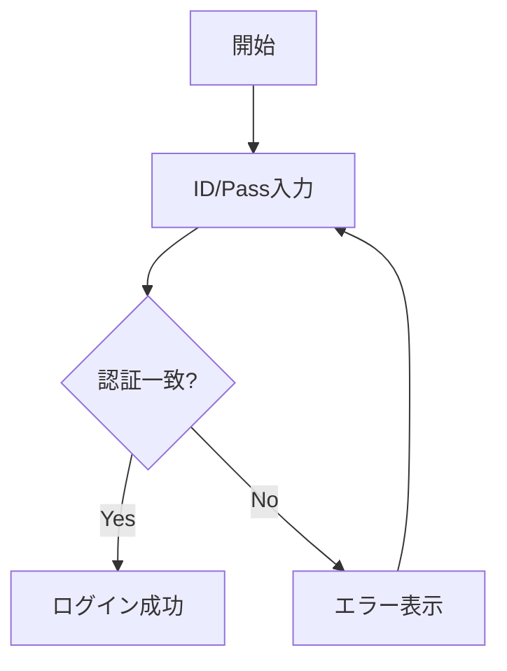
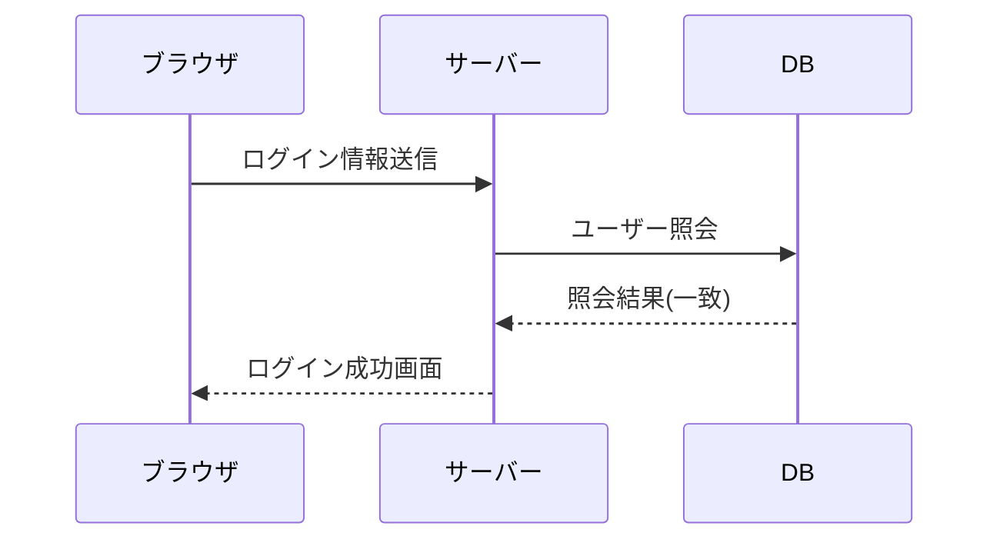

# MySite概要
このシステムは、学校の
授業の一環で・・・
# 野菜炒め

## 材料
- ニンジン
- キャベツ
- モヤシ

## 作り方
1. 野菜を切る
    - よく洗いましょう
    - 一口大に、大きさを揃えましょう
1. フライパンで炒める
1. 塩、コショウで味を調える

| ページ | URL | サーブレット |
|:----------:|:----------|---------------:|
| ホーム | /home | HomeServlet |
| 会社概要 | /about | AboutServlet |
| 製品リスト | /products | ProductServlet |

# システム仕様書

## 以下は処理の流れです。(フローチャート)

## 以下は機能の流れです。(シーケンス図)
